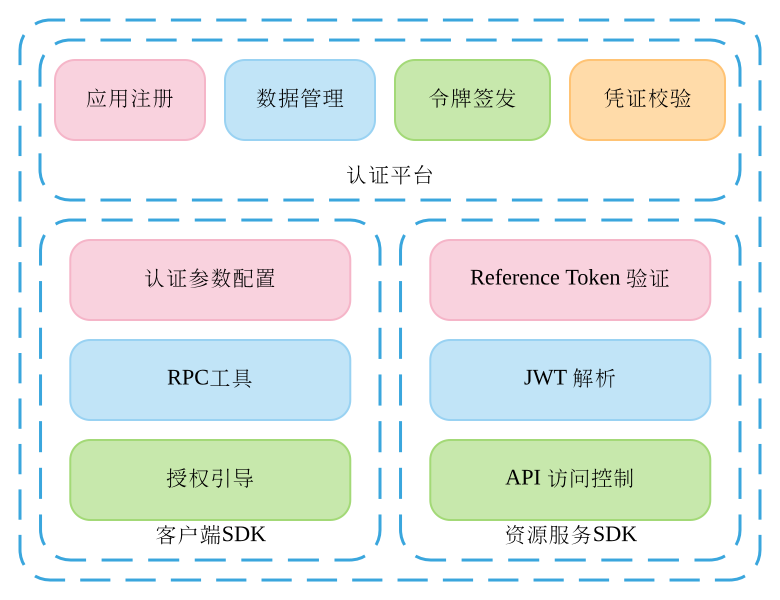
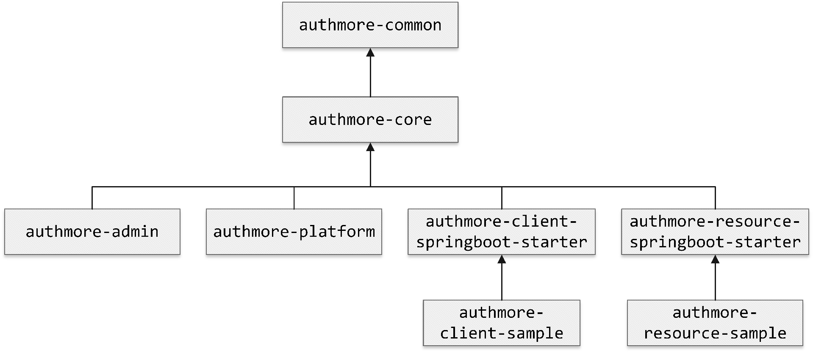

<p align="center">
  <a href="https://github.com/jameszbl/authmore">
   
  </a>
</p>

<p align="center">
  基于 OAuth2.0 协议的开放平台认证授权开发套件
</p>

<p align="center">
  <a href="https://search.maven.org/search?q=authmore">
    
  </a>

  <a href="https://travis-ci.org/JamesZBL/authmore-framework">
    
  </a>

  <a href="https://www.apache.org/licenses/LICENSE-2.0">
    
  </a>
</p>

# 简介 | Intro

基于 OAuth2.0 协议的开放平台认证授权开发套件

# 优点 | Advantages

- **简洁**：专注核心功能 —— 社会化网络下的跨应用认证授权，基于 Spring Boot Starter 的工具包，为开发者提供最简洁的配置。
- **快速**：Authmore 提供了客户端和资源服务端 SDK 及认证中心 Docker 镜像，一键部署，开箱即用。
- **高效**：基于 React.js 和 Ant Design 的认证中心管理系统，帮助开发者随时随地地管理应用，使数据操作透明化。

# 文档 | Documentation

[Authmore 最新开发手册](https://doc.authmore.letec.top)

# 原理 | Principle


# 结构目录 | Architecture


# 最新版本
> 提供最新版开放平台管理应用的 Docker 镜像，当然你也可以在开发环境下对源码打包部署
* **认证平台 Doccker 镜像**
```
jameszbl/authmore-platform:latest

jameszbl/authmore-admin:latest

jameszbl/authmore-ui:latest
```
* **客户端 SDK**
```xml
<dependency>
    <groupId>com.github.jameszbl</groupId>
    <artifactId>authmore-client-springboot-starter</artifactId>
    <version>1.0.8</version>
</dependency>
```

* **资源服务 SDK**
```xml
<dependency>
    <groupId>com.github.jameszbl</groupId>
    <artifactId>authmore-resource-springboot-starter</artifactId>
    <version>1.0.8</version>
</dependency>
```

# 版权 | License

[Apache License 2.0](https://www.apache.org/licenses/LICENSE-2.0)

# 关注我 | About Me

[摆码王子的小屋](https://b.letec.top)